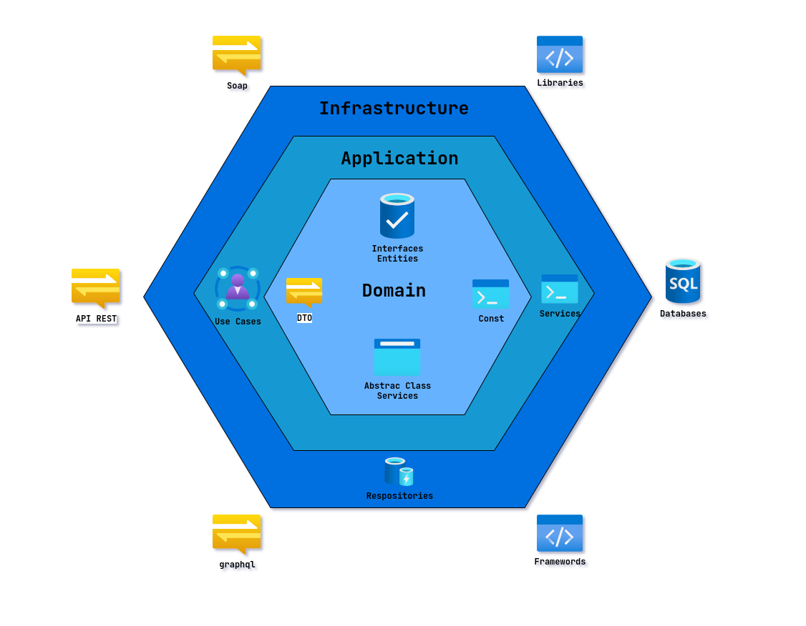

<p align="center">
  <a href="" rel="noopener">
    
  </a>
</p>

<h1 align="center">ePayco Backend API</h1>

<p align="center">
  Virtual wallet and payment system built with NestJS using Hexagonal Architecture (DDD)
</p>

---

## Table of Contents

- [Table of Contents](#table-of-contents)
- [Description](#description)
- [Architecture](#architecture)
- [Prerequisites](#prerequisites)
- [Installation](#installation)
  - [With Docker (Recommended)](#with-docker-recommended)
  - [Without Docker](#without-docker)
- [Configuration](#configuration)
  - [Example `.env` file](#example-env-file)
- [Running the Application](#running-the-application)
  - [Docker Commands](#docker-commands)
- [API Endpoints](#api-endpoints)
  - [Authentication](#authentication)
  - [Customers](#customers)
  - [Payments](#payments)
  - [Users (Admin)](#users-admin)
  - [Health Check](#health-check)
- [Testing](#testing)
  - [Running E2E Tests with Docker](#running-e2e-tests-with-docker)
- [API Documentation (Swagger)](#api-documentation-swagger)
- [Postman Collection](#postman-collection)
- [License](#license)
- [Official Documentation](#official-documentation)

---

## Description

ePayco is a backend API for a virtual wallet and payment system that allows:

- **Customer Registration**: Register customers linked to user accounts
- **Wallet Management**: Create and manage virtual wallets with balance
- **Wallet Recharge**: Add funds to customer wallets
- **P2P Payments**: Send money to other customers using document and phone
- **Merchant Payments**: Process payments from external merchants with OTP confirmation
- **Transaction History**: View all wallet movements

---

## Architecture

This project follows **Hexagonal Architecture** (also known as Ports and Adapters) combined with **Domain-Driven Design (DDD)** principles.

```
src/
├── module-name/
│   ├── application/          # Use cases and application services
│   │   └── services/
│   ├── domain/               # Business logic and entities
│   │   ├── dto/              # Data Transfer Objects
│   │   ├── entities/         # Domain entities
│   │   └── repository/       # Repository interfaces (ports)
│   └── infrastructure/       # External adapters
│       ├── mongoose/         # MongoDB implementation
│       │   ├── repositories/ # Repository implementations
│       │   └── schemas/      # Database schemas
│       └── nestjs/
│           └── controllers/  # HTTP controllers
```

---

## Prerequisites

- **Node.js** >= 22.x
- **Yarn** >= 1.22.x
- **Docker** and **Docker Compose** (for containerized setup)
- **MongoDB** >= 7.x (if running without Docker)

---

## Installation

### With Docker (Recommended)

1. **Clone the repository**

```bash
git clone <repository-url>
cd epayco
```

2. **Create environment file**

```bash
cp local.env .env
```

3. **Start the application**

```bash
docker compose -f docker-compose.dev.yml up -d
```

4. **Verify the application is running**

```bash
# Check container status
docker compose -f docker-compose.dev.yml ps

# View logs
docker compose -f docker-compose.dev.yml logs -f api
```

The API will be available at `http://localhost:3000`

5. **Stop the application**

```bash
docker compose -f docker-compose.dev.yml down
```

### Without Docker

1. **Clone the repository**

```bash
git clone <repository-url>
cd epayco
```

2. **Install dependencies**

```bash
yarn install
```

3. **Create environment file**

```bash
cp local.env .env
```

4. **Start MongoDB** (if not already running)

```bash
# Using mongod directly
mongod --dbpath /path/to/data

# Or using Docker for MongoDB only
docker run -d -p 27017:27017 --name mongo mongo:latest
```

5. **Update the MongoDB connection string** in your `.env` file:

```env
DB_MONGO="mongodb://localhost:27017/epayco"
```

6. **Start the application**

```bash
yarn start:dev
```

---

## Configuration

Create a `.env` file in the root directory with the following variables:

| Variable         | Description               | Example                                |
| ---------------- | ------------------------- | -------------------------------------- |
| `NODE_ENV`       | Environment mode          | `development`, `production`, `testing` |
| `PORT`           | Server port               | `3000`                                 |
| `CORS_ORIGIN`    | CORS allowed origins      | `*` or `https://yourdomain.com`        |
| `APP_NAME`       | Application name          | `epayco`                               |
| `APP_URL`        | Application URL           | `localhost`                            |
| `DB_MONGO`       | MongoDB connection string | `mongodb://mongo_dev:27017/epayco`     |
| `JWT_SECRET`     | JWT signing secret        | `your-super-secret-key`                |
| `JWT_EXPIRES_IN` | JWT expiration time       | `30d`                                  |
| `MAIL_HOST`      | SMTP host                 | `smtp.mailtrap.io`                     |
| `MAIL_PORT`      | SMTP port                 | `587` or `2525`                        |
| `MAIL_USER`      | SMTP username             | `your-smtp-user`                       |
| `MAIL_PASS`      | SMTP password             | `your-smtp-password`                   |
| `MAIL_FROM`      | Default sender email      | `noreply@epayco.com`                   |
| `MAIL_DEBUG`     | Enable SMTP debugging     | `false`                                |
| `MAIL_SSL`       | Enable SSL for SMTP       | `false` (use `true` for port 465)      |

### Example `.env` file

```env
NODE_ENV=development
PORT=3000
CORS_ORIGIN=*

APP_NAME=epayco
APP_URL=localhost

DB_MONGO="mongodb://mongo_dev:27017/epayco"

JWT_SECRET=your-super-secret-key-change-in-production
JWT_EXPIRES_IN=30d

MAIL_HOST=sandbox.smtp.mailtrap.io
MAIL_PORT=2525
MAIL_USER=your-mailtrap-user
MAIL_PASS=your-mailtrap-pass
MAIL_FROM=noreply@epayco.com
MAIL_DEBUG=false
MAIL_SSL=false
```

> **Note**: For Docker, use `mongo_dev` as the MongoDB host. For local development, use `localhost`.

---

## Running the Application

| Command            | Description                       |
| ------------------ | --------------------------------- |
| `yarn start`       | Start in production mode          |
| `yarn start:dev`   | Start in development mode (watch) |
| `yarn start:debug` | Start in debug mode               |
| `yarn start:prod`  | Start optimized production build  |
| `yarn build`       | Build the application             |

### Docker Commands

```bash
# Development
docker compose -f docker-compose.dev.yml up -d

# Production
docker compose -f docker-compose.prod.yml up -d

# View logs
docker compose -f docker-compose.dev.yml logs -f

# Rebuild containers
docker compose -f docker-compose.dev.yml up -d --build

# Stop and remove containers
docker compose -f docker-compose.dev.yml down

# Stop and remove containers with volumes
docker compose -f docker-compose.dev.yml down -v
```

---

## API Endpoints

Base URL: `http://localhost:3000/api`

### Authentication

| Method | Endpoint                        | Description                 | Auth Required |
| ------ | ------------------------------- | --------------------------- | ------------- |
| POST   | `/auth/register`                | Register a new user         | No            |
| POST   | `/auth/login`                   | Login and get JWT token     | No            |
| GET    | `/auth/me`                      | Get current user profile    | Yes           |
| PATCH  | `/auth/me`                      | Update current user profile | Yes           |
| POST   | `/auth/forgot-password`         | Request password reset      | No            |
| PUT    | `/auth/restore-password/:token` | Reset password with token   | No            |

### Customers

| Method | Endpoint                     | Description                             | Auth Required |
| ------ | ---------------------------- | --------------------------------------- | ------------- |
| POST   | `/customers/register`        | Register as a customer (creates wallet) | Yes           |
| GET    | `/customers/me`              | Get customer profile                    | Yes           |
| GET    | `/customers/wallet/balance`  | Get wallet balance                      | Yes           |
| POST   | `/customers/wallet/recharge` | Recharge wallet                         | Yes           |

### Payments

| Method | Endpoint            | Description                          | Auth Required |
| ------ | ------------------- | ------------------------------------ | ------------- |
| POST   | `/payments/request` | Request merchant payment (sends OTP) | Yes           |
| POST   | `/payments/send`    | Send P2P payment (sends OTP)         | Yes           |
| POST   | `/payments/confirm` | Confirm payment with OTP             | Yes           |
| GET    | `/payments/history` | Get transaction history              | Yes           |

### Users (Admin)

| Method | Endpoint     | Description    | Auth Required |
| ------ | ------------ | -------------- | ------------- |
| GET    | `/users`     | List all users | Yes           |
| POST   | `/users`     | Create a user  | Yes           |
| GET    | `/users/:id` | Get user by ID | Yes           |
| PUT    | `/users/:id` | Update user    | Yes           |
| DELETE | `/users/:id` | Delete user    | Yes           |

### Health Check

| Method | Endpoint        | Description             | Auth Required |
| ------ | --------------- | ----------------------- | ------------- |
| GET    | `/health-check` | Check API health status | No            |

---

## Testing

```bash
# Unit tests
yarn test

# Unit tests (watch mode)
yarn test:watch

# End-to-end tests
yarn test:e2e

# Integration tests
yarn test:int

# Test coverage
yarn test:cov
```

### Running E2E Tests with Docker

```bash
# Make sure the test database is running
docker compose -f docker-compose.dev.yml up -d mongodb

# Run e2e tests
yarn test:e2e
```

---

## API Documentation (Swagger)

Once the application is running, access the interactive API documentation at:

```
http://localhost:3000/api/docs
```

---

## Postman Collection

A Postman collection is available in the `docs/` folder:

```
docs/core-v2.postman_collection.json
```

Import this file into Postman to test all API endpoints.

---

## License

UNLICENSED - Private

---

## Official Documentation

- [NestJS Documentation](https://docs.nestjs.com/)
- [Mongoose Documentation](https://mongoosejs.com/docs/)
- [Docker Documentation](https://docs.docker.com/)
